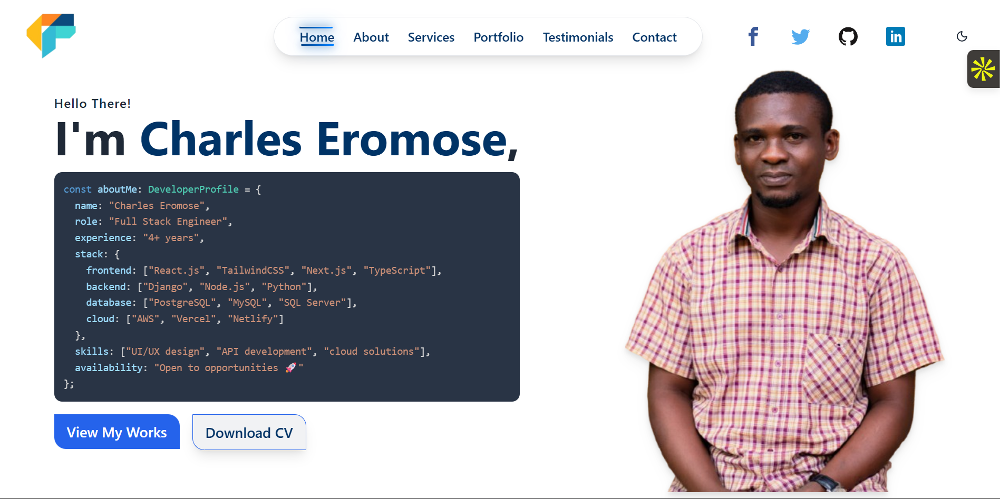

<div align="center">

# ✦ Charles Eromose — Personal Portfolio

**Live:** [charleseromose.netlify.app](https://charleseromose.netlify.app) &nbsp;|&nbsp;
**LinkedIn:** [eromosele-charles](https://www.linkedin.com/in/eromosele-charles-152181337/) &nbsp;|&nbsp;
**GitHub:** [@OkuekhamhenEromose](https://github.com/OkuekhamhenEromose)

</div>

---

A next-generation personal portfolio built with **Next.js 16**, **Framer Motion**, **GSAP**, and **Tailwind CSS v4** — featuring a cinematic preloader, GPU-composited scroll animations, a horizontal project carousel, and a fully responsive dark-mode design.



---

## 🚀 Tech Stack

| Layer | Technology |
|---|---|
| **Framework** | Next.js 16 (App Router, React 19) |
| **Language** | TypeScript 5 |
| **Styling** | Tailwind CSS v4 |
| **Animations** | Framer Motion 12 + GSAP 3 + ScrollTrigger |
| **Icons** | Lucide React · React Icons |
| **Email** | EmailJS Browser SDK |
| **Fonts** | Inter · Clash Display · Margareth Rosinante · Fira Code |
| **Deployment** | Vercel / Netlify |

---

## ✨ Features

- **Cinematic Preloader** — SVG morphing path exit with multilingual greeting words cycling through 7 languages
- **GPU-Composited Marquee** — CSS `animation` on the compositor thread; GSAP ScrollTrigger modulates playback speed without touching `transform` on the main thread
- **Horizontal Portfolio Carousel** — GSAP-pinned section with per-category filtering, staggered card entrance/exit animations, and zero layout flash (via `useLayoutEffect` + `gsap.set`)
- **Scroll-Driven Testimonials** — Cards fly in from alternating sides; triggers recalculate automatically when the Portfolio filter changes
- **ScrollTrigger Service Summary** — Four rows of giant kinetic typography slide in from opposing directions on scroll
- **Responsive Mobile Nav** — Clip-path slide-in panel with staggered nav items and a custom hamburger that morphs to a close icon
- **Contact Form** — EmailJS `sendForm` integration with full client-side validation and toast notifications
- **Dark Mode Only** — Forced dark theme via `ThemeProvider`; space video background with overlay grid dots
- **Scroll Restoration Fix** — Inline blocking script in `<head>` kills browser scroll restoration before React hydrates

---

## 📁 Project Structure

```
charles-portfolio/
├── app/
│   ├── fonts/                    # Local fonts (ClashDisplay, Margareth)
│   ├── globals.css               # Tailwind base + custom CSS variables
│   ├── layout.tsx                # Root layout · metadata · font injection
│   └── page.tsx                  # Home page · section orchestration
│
├── components/
│   ├── Preloader.tsx             # SVG morphing preloader
│   ├── Header.tsx                # Fixed nav · scroll-aware glass effect
│   ├── MobileNav.tsx             # Clip-path slide-in mobile menu
│   ├── Socials.tsx               # Animated social links
│   ├── Hero.tsx                  # Marquee + CodeBlock + Globe video
│   ├── About.tsx                 # Bio · stats · dual-row skill marquee
│   ├── ServiceSummary.tsx        # GSAP kinetic typography rows
│   ├── Services.tsx              # 6-card services grid
│   ├── Portfolio.tsx             # GSAP horizontal scroll carousel
│   ├── Testimonials.tsx          # Scroll-triggered testimonial cards
│   ├── CompaniesWorked.tsx       # Inline SVG logo grid
│   ├── Contact.tsx               # EmailJS contact form + map
│   ├── Footer.tsx                # Nav links · social links · back-to-top
│   └── ThemeProvider.tsx         # Forced dark theme context
│
├── public/
│   ├── images/                   # Portfolio screenshots · testimonial photos
│   ├── video/                    # space.mp4 (bg) · glob_transparent.webm
│   ├── CharlesEromose.pdf        # Downloadable CV
│   └── icon.png
│
├── next.config.ts
├── package.json
└── tsconfig.json
```

---

## 🛠️ Getting Started

### Prerequisites

- Node.js ≥ 18.17
- npm, yarn, or pnpm

### Installation

```bash
# 1. Clone the repository
git clone https://github.com/OkuekhamhenEromose/charles-portfolio.git
cd charles-portfolio

# 2. Install dependencies
npm install

# 3. Set up environment variables
cp .env.example .env.local
# Then fill in your EmailJS credentials (see below)

# 4. Run the development server
npm run dev
```

Open [http://localhost:3000](http://localhost:3000) in your browser.

---

## 📧 EmailJS Configuration

The contact form uses [EmailJS](https://emailjs.com) to send messages directly from the browser — no backend required.

1. Create a free account at [emailjs.com](https://emailjs.com)
2. Connect your email service (Gmail / Outlook) and note the **Service ID**
3. Create an email template using these exact variable names:
   ```
   {{from_name}}   — sender's full name
   {{from_email}}  — sender's email (set as Reply-To)
   {{subject}}     — message subject
   {{message}}     — message body
   ```
4. Copy your **Template ID** and **Public Key**
5. Add them to `.env.local`:

```env
NEXT_PUBLIC_EMAILJS_SERVICE_ID=service_xxxxxxx
NEXT_PUBLIC_EMAILJS_TEMPLATE_ID=template_xxxxxxx
NEXT_PUBLIC_EMAILJS_PUBLIC_KEY=xxxxxxxxxxxxxxxx
```

> ⚠️ Never commit real API keys to a public repository.

---

## 📜 Available Scripts

```bash
npm run dev      # Start development server (http://localhost:3000)
npm run build    # Create production build
npm run start    # Start production server
npm run lint     # Run ESLint
```

---

## 🎨 Animation Architecture

### Marquee (Hero)
The hero marquee runs as a pure CSS `animation` on the GPU compositor thread. GSAP ScrollTrigger listens for scroll velocity changes and updates only `animation-duration` — no per-frame main-thread work, no jank.

### Horizontal Portfolio Scroll
GSAP pins the portfolio section and drives a horizontal `translateX` tween via `scrub`. Category filtering tears down and rebuilds the ScrollTrigger cleanly, with `useLayoutEffect` hiding incoming cards before the browser paints to eliminate flash.

### Testimonials Coordination
Testimonial triggers register after Portfolio dispatches a `portfolio:filter-changed` event, ensuring positions are calculated against the settled pinSpacer layout.

---

## 🌐 Deployment

### Vercel (Recommended)

```bash
npm install -g vercel
vercel
```

Add your `NEXT_PUBLIC_EMAILJS_*` environment variables in the Vercel project dashboard under **Settings → Environment Variables**.

### Netlify

```bash
npm run build
# Deploy the `.next` output folder or connect via GitHub
```

---

## 📦 Key Dependencies

```json
{
  "next": "16.2.4",
  "react": "19.2.4",
  "framer-motion": "^12.38.0",
  "gsap": "^3.15.0",
  "@gsap/react": "^2.1.2",
  "@emailjs/browser": "^4.4.1",
  "tailwindcss": "^4",
  "react-icons": "^5.6.0",
  "lucide-react": "^1.8.0"
}
```

---

## 📄 License

This project is open source and available under the [MIT License](LICENSE).

---

<div align="center">

**Built with passion in Lagos, Nigeria 🇳🇬**

*Designed & developed by Charles Eromose Okuekhahmen*

⭐ If this project inspired you, consider giving it a star!

</div>